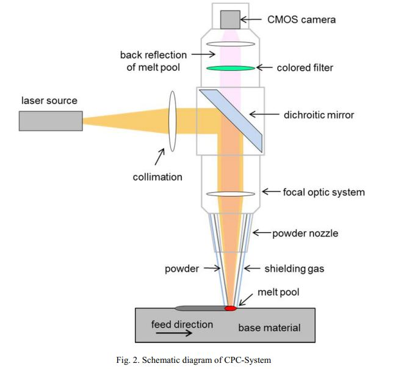

# Correlations of melt pool geometry and process parameters during laser metal deposition by coaxial

## 目的

討論melt pool 幾何形狀與process parameters 的相關性

## 系統架構

<figure><figcaption></figcaption></figure>

&#x20;

#### 材料

* base material : tool steel X38CrMoV 5-1
* powder material: 32CrMoV 12-28 $$(powder\ diameter: 45-100\mu m )$$

#### 實驗參數

| P\[w] | V\[mm/min] | m   |
| ----- | ---------- | --- |
| 600   | 300        | 1.2 |
| 1800  | 1200       | 4.8 |

### Notes

* $$Melt\ pool\ Length\ >\ width \rightarrow \ measure \ width ,\ length\ area\ of\ the\ melt \ melt \ pool$$
* $$Melt\ pool\ size \propto Laser\ power (linear relation)$$\
  相較起來 移動速度 對spot diamter的影響比雷射功率小，影響最小的是粉末供應的速率\
  ex.\
  移動速率 由 600 mm/min -> 300 mm/min , spot diameter 從 2.28 $$mm^2$$ -> 3.06 $$mm^2$$ $$\Rightarrow 增加34.2 \%$$\
  雷射功率由 700 w -> 1400 w ， spot diameter 1.072 $$mm^2$$ -> 4.778 $$mm^2$$\
  $$\Rightarrow 增加346\%$$
* $$在不同層高，設計不同的laser\ power，在某個層高後，melt\ pool\ size 便穩定$$
*   $$在相同能量密度[ J/mm] 條件下，隨著移動速度的增加，melt\ pool\ size 也跟著增加$$

    &#x20;

*

##

## 問題

\- 不確定是否跟材質有關?\
如果替換成其他基材，是否一樣可以選740 nm 的波長來做觀察就好

* CCD 前面加裝的 color filter ,  屬於band pass filter , 頻率區段是多少?
*

