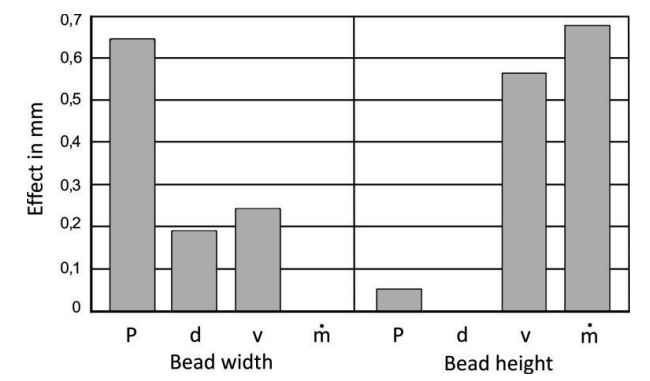

# Design of experiments for laser metal deposition in maintenance, repair and  overhaul applications

## 摘要

## 實驗方法

實驗設計方法可以有效減少實驗次數，進行參數優化

提到有些研究利用CCD 中央合成法或 田口法進行實驗設計

或是比較不同實驗設計方法的差異

此篇，利用全因子設計，比較四個參數，兩個水準

參數表如下

|                          | -1(Min) | +1(Max) |
| ------------------------ | ------- | ------- |
| Laser Power(w)           | 800     | 1700    |
| Spot diameter(mm)        | 1.2     | 1.8     |
| Scan speed V(mm/min)     | 320     | 680     |
| Powder Mass flow (g/min) | 5       | 11      |

## 實驗結果

各參數對於熔覆特徵的影響

<figure><figcaption></figcaption></figure>

作者整理了寬度、高度與製程參數的相關式

$$width = (2.32 + \frac{0.64}{2} P + \frac{0.2}{2} d - \frac{0.26}{2} - \frac{0.14}{2} v\dot m)  [mm]$$

$$height=(0.96+\frac{0.06}{2} P- \frac{0.57}{2} v + \frac{0.69}{2}\dot m - \frac{0.06}{2}Pd -\frac{0.17}{2} v \dot m) [mm]$$

\---

## 限制

\- 實驗點設計範圍不夠大，可以再擴大參數設計範圍

