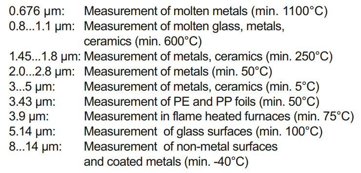

# Pyrometer

## Pyrometer survey

> 監控熔池的溫度。但由於依據材料去調整輻射率 因此會需要搭配光學相機作為輔助

## 廠家

* Impac
* [Optris](https://www.usoon.com.tw/)
* [Keiber](https://kleiberinfrared.com/index.php/en/products/highspeed/series840/pyrometer840.html)
* [LumaSense](https://www.disai.net/wp-content/uploads/catalogos\_pdf/MI\_en-op-iga6-23-advanced-manual.pdf\))
* [Thermal image camera](https://www.advancedenergy.com/globalassets/resources-root/brochures/en-ti-thermaloverview-brochure.pdf)

### 選擇過程需要注意

* Field of View (FOV)

> FOV = Measuring distance / spot size

* 頻譜範圍

> 基於量測的目標物材質，所需要鎖定的波段範圍也不同。 常見材料的如下:
>
> 

* 響應時間
* 輸出
  * 類比輸出
  * 數位介面 RS232 / 485
  * Profibus-DP
* 搭配的軟體或是開放的API

## 參考

* [IMPAC Manual](http://www.asras.co.th/images/introc\_1363157515/IMPAC%20Infrared%20New.pdf)
* [Optris pyrometer selector](https://www.optris.global/pyrometer-configurator)
